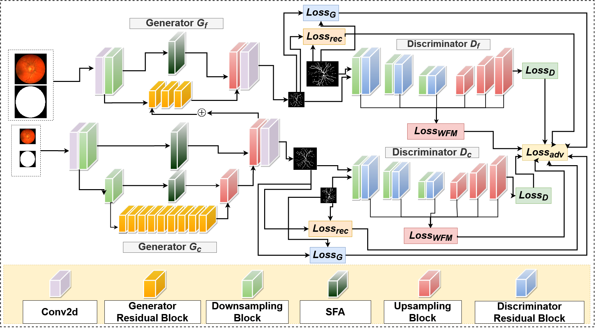

# MICCAI2021 RVGAN

[](https://paperswithcode.com/sota/retinal-vessel-segmentation-on-drive?p=rv-gan-retinal-vessel-segmentation-from)
[](https://paperswithcode.com/sota/retinal-vessel-segmentation-on-chase_db1?p=rv-gan-retinal-vessel-segmentation-from)
[](https://paperswithcode.com/sota/retinal-vessel-segmentation-on-stare?p=rv-gan-retinal-vessel-segmentation-from)


This code is for our paper "RV-GAN: Segmenting Retinal Vascular Structure inFundus Photographs using a Novel Multi-scaleGenerative Adversarial Network" which is part of the supplementary materials for MICCAI 2021 conference. The paper has since been accpeted and presented at MICCAI 2021.



### Arxiv Pre-print
```
https://arxiv.org/pdf/2101.00535v2.pdf
```
### Springer
```
https://link.springer.com/chapter/10.1007/978-3-030-87237-3_4
```


# Citation
```
@inproceedings{kamran2021rv,
  title={RV-GAN: Segmenting retinal vascular structure in fundus photographs using a novel multi-scale generative adversarial network},
  author={Kamran, Sharif Amit and Hossain, Khondker Fariha and Tavakkoli, Alireza and Zuckerbrod, Stewart Lee and Sanders, Kenton M and Baker, Salah A},
  booktitle={International Conference on Medical Image Computing and Computer-Assisted Intervention},
  pages={34--44},
  year={2021},
  organization={Springer}
}
```


# Virtual Oral Presentation (Youtube)

[](https://www.youtube.com/watch?v=O64-aienoxw) 


## Pre-requisite
- Ubuntu 18.04 / Windows 7 or later
- NVIDIA Graphics card

## Current branch is for Tensorflow 2.0-gpu version
## For Tensorflow 2.6-gpu version check the following branch
```
https://github.com/SharifAmit/RVGAN/tree/tf-2.6
```

## Installation Instruction for Ubuntu
- Download and Install [Nvidia Drivers](https://www.nvidia.com/Download/driverResults.aspx/142567/en-us)
- Download and Install via Runfile [Nvidia Cuda Toolkit 10.0](https://developer.nvidia.com/cuda-10.0-download-archive?target_os=Linux&target_arch=x86_64&target_distro=Ubuntu&target_version=1804&target_type=runfilelocal)
- Download and Install [Nvidia CuDNN 7.6.5 or later](https://developer.nvidia.com/rdp/cudnn-archive)
- Install Pip3 and Python3 enviornment
```
sudo apt-get install pip3 python3-dev
```
- Install Tensorflow-Gpu version-2.0.0 and Keras version-2.3.1
```
sudo pip3 install tensorflow-gpu==2.0.0
sudo pip3 install keras==2.3.1
```
- Install packages from requirements.txt
```
sudo pip3 install -r requirements.txt
```

### DRIVE Dataset

- Please cite the paper if you use their data
```
@article{staal2004ridge,
  title={Ridge-based vessel segmentation in color images of the retina},
  author={Staal, Joes and Abr{\`a}moff, Michael D and Niemeijer, Meindert and Viergever, Max A and Van Ginneken, Bram},
  journal={IEEE transactions on medical imaging},
  volume={23},
  number={4},
  pages={501--509},
  year={2004},
  publisher={IEEE}
}
```

### Dataset download link for DRIVE
```
https://drive.grand-challenge.org/
```

### STARE Dataset

- Please cite the paper if you use their data
```
@article{hoover2000locating,
  title={Locating blood vessels in retinal images by piecewise threshold probing of a matched filter response},
  author={Hoover, AD and Kouznetsova, Valentina and Goldbaum, Michael},
  journal={IEEE Transactions on Medical imaging},
  volume={19},
  number={3},
  pages={203--210},
  year={2000},
  publisher={IEEE}
}
```

### Dataset download link for STARE
```
https://cecas.clemson.edu/~ahoover/stare/
```

### CHASE-DB1 Dataset

- Please cite the paper if you use their data
```
@article{owen2009measuring,
  title={Measuring retinal vessel tortuosity in 10-year-old children: validation of the computer-assisted image analysis of the retina (CAIAR) program},
  author={Owen, Christopher G and Rudnicka, Alicja R and Mullen, Robert and Barman, Sarah A and Monekosso, Dorothy and Whincup, Peter H and Ng, Jeffrey and Paterson, Carl},
  journal={Investigative ophthalmology \& visual science},
  volume={50},
  number={5},
  pages={2004--2010},
  year={2009},
  publisher={The Association for Research in Vision and Ophthalmology}
}
```

### Dataset download link for CHASE-DB1
```
https://blogs.kingston.ac.uk/retinal/chasedb1/
```

### Dataset Pre-processing

- Type this in terminal to run the **strided_crop_DRIVE.py**, **strided_crop_STARE.py** or **strided_crop_CHASE.py** file. 
```
python3 strided_crop_DRIVE.py --input_dim=128 --stride=32
```
- There are different flags to choose from. Not all of them are mandatory.
```
    '--input_dim', type=int, default=128
    '--stride', type=int, default=32
```

### NPZ file conversion
- Convert all the images to npz format using **convert_npz_DRIVE.py**, **convert_npz_STARE.py** or **convert_npz_CHASE.py** file. 
```
python3 convert_npz_DRIVE.py --input_dim=(128,128) --n_crops=210 --outfile_name='DRIVE'
```
- There are different flags to choose from. Not all of them are mandatory.
```
    '--input_dim', type=int, default=(128,128)
    '--n_crops', type=int, default=210
    '--outfile_name', type=str, default='DRIVE'
```

## Training

- Type this in terminal to run the train.py file
```
python3 train.py --npz_file=DRIVE --batch=4 --epochs=200 --savedir=RVGAN --resume_training=no --inner_weight=0.5
```
- There are different flags to choose from. Not all of them are mandatory

```
   '--npz_file', type=str, default='DRIVE.npz', help='path/to/npz/file'
   '--batch_size', type=int, default=24
   '--input_dim', type=int, default=128
   '--epochs', type=int, default=200
   '--savedir', type=str, required=False, help='path/to/save_directory',default='RVGAN'
   '--resume_training', type=str, required=False,  default='no', choices=['yes','no']
   '--inner_weight', type=float, default=0.5
```

## Pretrained Weights
```
https://drive.google.com/drive/folders/1GxUzvFaLdeMtKIAeegswznLQzc4T7NZS?usp=sharing
```

## Inference

- Type this in terminal to run the infer.py file
```
python3 infer.py --test_data=DRIVE --out_dir=test --weight_name_global=global_model_100.h5 --weight_name_local=local_model_100.h5 --stride=3 
```
- There are different flags to choose from. Not all of them are mandatory

```
    '--test_data', type=str, default='DRIVE', required=True, choices=['DRIVE','CHASE','STARE']
    '--out_dir', type=str, default='pred', required=False)
    '--weight_name_global',type=str, help='path/to/global/weight/.h5 file', required=True
    '--weight_name_local',type=str, help='path/to/local/weight/.h5 file', required=True
    '--stride', type=int, default=3, help='For faster inference use stride 16/32, for better result use stride 3.'
```


## Evaluation on test set

- Type this in terminal to run the infer.py file
```
python3 eval.py --test_data=DRIVE --weight_name_global=global_model_100.h5 --weight_name_local=local_model_100.h5 --stride=3 
```
- There are different flags to choose from. Not all of them are mandatory

```
    '--test_data', type=str, default='DRIVE', required=True, choices=['DRIVE','CHASE','STARE']
    '--weight_name_global',type=str, help='path/to/global/weight/.h5 file', required=True
    '--weight_name_local',type=str, help='path/to/local/weight/.h5 file', required=True
    '--stride', type=int, default=3, help='For faster inference use stride 16/32, for better result use stride 3.'
```

# License
The code is released under the BSD 3-Clause License, you can read the license file included in the repository for details.

